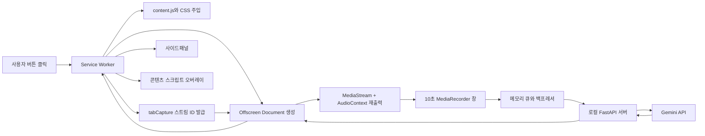

# Chrome 강의 자막·요약 노트 확장 프로그램 설계서 v2

## 1. 문서 목적

Chrome에서 재생 중인 강의 탭의 오디오를 사용자가 명시적으로 캡처하여 다음 기능을 제공하는 Manifest V3 확장 프로그램과 로컬 Python 중계 서버를 설계합니다.

- 한국어 준실시간 자막
- 영상 위 자막 오버레이
- 자막·북마크의 영상 타임스탬프 이동
- 중간 요약과 최종 학습 노트
- Markdown, TXT, SRT, VTT 내보내기

화면, 아이콘, 문구, 코드는 독자적으로 작성합니다. 캡처 대상은 사용 권한이 있는 콘텐츠로 제한하며 DRM이나 접근 제한을 우회하지 않습니다.

## 2. 핵심 결정

| 항목 | 결정 |
|---|---|
| 확장 프로그램 형식 | Chrome Manifest V3 |
| 최소 Chrome 버전 | 116 |
| 캡처 시작 조건 | 사용자가 확장 프로그램 버튼을 직접 클릭 |
| 오디오 캡처 | `chrome.tabCapture.getMediaStreamId()` + Offscreen Document |
| 오디오 형식 | 우선 `audio/webm;codecs=opus`, 실제 지원 여부 확인 후 fallback |
| 오디오 창 | 10초 |
| 요청 간격 | 9초 |
| 겹침 | 1초 |
| 처리 동시성 | 1개 |
| 자막 모델 기본값 | `gemini-3.6-flash`, 환경 변수로 교체 가능 |
| 확장 프로그램→서버 전송 | Base64가 아닌 `multipart/form-data` 바이너리 |
| Gemini 전송 | 20MB 미만 인라인 오디오 요청 |
| 오디오 큐 논리 한도 | 8MB 경고, 10MB 일시정지, 6MB 이하에서 재개 |
| 저장 | 세션 메모리만 사용, 오디오를 디스크에 저장하지 않음 |
| API 키 | 로컬 Python 서버의 환경 변수에만 저장 |
| JSON 응답 | 프롬프트 의존이 아닌 구조화 출력 스키마 사용 |

`10MB`는 브라우저 프로세스 전체 메모리 한도가 아니라 대기·전송 중인 오디오 Blob 큐의 논리 상한입니다. JavaScript에서 브라우저 전체 메모리를 정확히 강제할 수 없으므로 자막·요약·DOM 사용량은 별도로 관찰합니다.

## 3. 전체 아키텍처



역할은 다음처럼 분리합니다.

- Service Worker: 사용자 동작 처리, 컨텍스트 생성, 메시지 라우팅, 탭 수명주기 감시
- Offscreen Document: 오디오 스트림, 레코더, 큐, 세션 상태의 실제 소유자
- Content Script: 영상 탐색, 재생 시간 매핑, 오버레이, 타임스탬프 이동
- Side Panel: 자막·노트·북마크 UI와 사용자 제어
- Python 서버: 요청 검증, Gemini 호출, 구조화 출력 검증, 요약 생성

서비스 워커의 전역 변수에는 세션의 원본 상태를 저장하지 않습니다. 서비스 워커는 유휴 상태에서 종료될 수 있으므로, 필요한 상태는 Offscreen Document가 보관하고 다시 열린 UI가 상태 스냅샷을 요청합니다.

## 4. 권장 프로젝트 구조

```text
web_capture/
├─ extension/
│  ├─ manifest.json
│  ├─ service_worker.js
│  ├─ offscreen.html
│  ├─ offscreen.js
│  ├─ sidepanel.html
│  ├─ sidepanel.js
│  ├─ content.js
│  ├─ styles.css
│  └─ protocol.js
├─ server/
│  ├─ app.py
│  ├─ settings.py
│  ├─ schemas.py
│  ├─ gemini_client.py
│  ├─ requirements.txt
│  └─ .env.example
├─ tests/
│  ├─ extension/
│  └─ server/
└─ README.md
```

`protocol.js`에는 메시지 이름과 공통 데이터 구조만 둡니다. Offscreen Document와 서비스 워커 사이에서 큰 오디오 Blob을 반복 복사하지 않도록 오디오 업로드는 Offscreen Document가 직접 수행합니다.

## 5. Manifest 설계

Chrome 확장 프로그램에는 루트 `manifest.json`이 반드시 필요합니다. 이 파일은 확장 프로그램의 진입점, 권한, 서비스 워커, 사이드패널을 Chrome에 선언합니다.

```json
{
  "manifest_version": 3,
  "name": "Lecture Memo",
  "version": "0.1.0",
  "description": "재생 중인 강의의 자막과 학습 노트를 생성합니다.",
  "minimum_chrome_version": "116",
  "permissions": [
    "activeTab",
    "tabCapture",
    "offscreen",
    "sidePanel",
    "scripting"
  ],
  "host_permissions": [
    "http://127.0.0.1:8000/*"
  ],
  "background": {
    "service_worker": "service_worker.js"
  },
  "action": {
    "default_title": "강의 자막 시작"
  },
  "side_panel": {
    "default_path": "sidepanel.html"
  }
}
```

권한 사용 원칙은 다음과 같습니다.

- `activeTab`: 버튼을 클릭한 현재 탭에만 일시적으로 접근합니다.
- `tabCapture`: 현재 탭 오디오 스트림을 얻습니다.
- `offscreen`: DOM·MediaRecorder를 사용할 숨은 문서를 만듭니다.
- `sidePanel`: 사이드패널 UI를 엽니다.
- `scripting`: 버튼 클릭 후 `content.js`와 `styles.css`를 현재 탭에만 주입합니다.
- `host_permissions`: 확장 프로그램 컨텍스트에서 로컬 서버에 요청합니다.

초기 버전은 광범위한 `https://*/*` 권한과 정적 `content_scripts`를 사용하지 않습니다. 사용자가 버튼을 누른 탭에만 다음 방식으로 프로그램 방식 주입을 수행합니다.

```javascript
await chrome.scripting.executeScript({
  target: { tabId: tab.id },
  files: ["content.js"]
});

await chrome.scripting.insertCSS({
  target: { tabId: tab.id },
  files: ["styles.css"]
});
```

`chrome://`, Chrome Web Store, 권한이 없는 `file://` 페이지처럼 스크립트 주입이 금지된 페이지에서는 캡처를 시작하지 않고 사용자에게 이유를 표시합니다.

다음 권한은 현재 단계에서 추가하지 않습니다.

- `tabs`: 탭 ID 사용만으로는 필요하지 않습니다. URL·제목 등 민감한 탭 정보를 상시 읽어야 할 때만 검토합니다.
- `storage`: 데이터는 세션 메모리에만 유지합니다.
- `downloads`: Blob과 `<a download>`로 내보내면 필요하지 않습니다. `chrome.downloads` API를 사용하게 될 때만 추가합니다.
- Gemini 도메인 권한: Gemini API는 Python 서버만 호출하므로 확장 프로그램에는 필요하지 않습니다.

Chrome Web Store 배포 시에는 실제 파일이 준비된 뒤 `icons` 항목을 추가합니다.

## 6. 세션 시작 흐름

```text
사용자 action 클릭
→ 캡처 가능한 URL인지 확인
→ content.js와 styles.css 주입
→ content.js에서 영상 요소와 초기 재생 상태 확인
→ Offscreen Document 존재 여부 확인 후 생성
→ tabCapture 스트림 ID 발급
→ Offscreen Document에 START_CAPTURE 전달
→ 사이드패널 열기
→ 캡처 상태를 모든 UI에 전달
```

Offscreen Document는 중복 생성하지 않습니다.

```javascript
const offscreenUrl = chrome.runtime.getURL("offscreen.html");
const contexts = await chrome.runtime.getContexts({
  contextTypes: ["OFFSCREEN_DOCUMENT"],
  documentUrls: [offscreenUrl]
});

if (contexts.length === 0) {
  await chrome.offscreen.createDocument({
    url: "offscreen.html",
    reasons: ["USER_MEDIA"],
    justification: "사용자가 선택한 탭의 오디오를 자막으로 변환합니다."
  });
}
```

`getMediaStreamId()`가 반환한 ID는 한 번만 사용할 수 있고 짧은 시간 뒤 만료되므로, 발급 직후 Offscreen Document가 소비해야 합니다.

## 7. 오디오 캡처와 원래 소리 유지

Offscreen Document에서 스트림을 가져옵니다.

```javascript
const mediaStream = await navigator.mediaDevices.getUserMedia({
  audio: {
    mandatory: {
      chromeMediaSource: "tab",
      chromeMediaSourceId: streamId
    }
  },
  video: false
});
```

탭 오디오를 캡처하면 원래 탭 소리가 사용자에게 재생되지 않을 수 있으므로 AudioContext로 다시 출력합니다.

```javascript
const audioContext = new AudioContext();
const source = audioContext.createMediaStreamSource(mediaStream);
source.connect(audioContext.destination);
await audioContext.resume();
```

MIME 타입은 실행 시 확인합니다.

```javascript
const MIME_CANDIDATES = [
  "audio/webm;codecs=opus",
  "audio/webm"
];

const mimeType = MIME_CANDIDATES.find((type) =>
  MediaRecorder.isTypeSupported(type)
);

if (!mimeType) {
  throw new Error("지원되는 WebM 오디오 인코더가 없습니다.");
}
```

실제 Blob의 `type`과 `size`를 서버에 전달하고, `audioBitsPerSecond`가 정확히 적용된다고 가정하지 않습니다.

## 8. 10초 창과 1초 겹침

```text
00~10초
09~19초
18~28초
27~37초
```

MVP에서는 같은 MediaStream에 MediaRecorder 두 개를 교차 실행하여 각 창을 독립된 WebM Blob으로 만듭니다. 시작·종료 시각은 `setInterval` 횟수가 아니라 `performance.now()` 기준으로 기록합니다.

검증 항목은 다음과 같습니다.

- 두 MediaRecorder를 동시에 실행했을 때 Chrome에서 각 Blob이 독립적으로 재생되는지
- 장시간 실행 시 창 길이 드리프트가 누적되지 않는지
- 종료 시 마지막 1초 이상의 부분 청크가 정상적으로 flush되는지
- 스트림이 끝날 때 모든 Recorder와 타이머가 정리되는지

교차 MediaRecorder가 특정 환경에서 불안정할 때만 AudioWorklet 기반으로 전환합니다. AudioWorklet 링 버퍼는 WebM/Opus 인코딩을 자동으로 제공하지 않으므로 별도 인코딩 경로까지 함께 설계한 뒤 사용합니다.

첫 자막 지연시간은 단순히 10초가 아닙니다.

```text
첫 자막 지연 = 10초 캡처 + 업로드 + 모델 처리 + UI 반영
```

## 9. 영상 타임라인과 자막 타임스탬프

녹화 경과 시간을 그대로 `video.currentTime`으로 사용하면 안 됩니다. 사용자가 영상을 중간부터 시작하거나 일시정지, 탐색, 재생속도 변경을 하면 두 시간이 달라집니다.

Content Script는 다음 이벤트를 감시합니다.

- `play`, `pause`
- `seeking`, `seeked`
- `ratechange`
- `ended`
- `fullscreenchange`

각 오디오 창에는 다음 매핑 정보를 붙입니다.

```json
{
  "sequence": 3,
  "capture_start_ms": 18000,
  "capture_end_ms": 28000,
  "video_start_ms": 732000,
  "playback_rate": 1.0,
  "overlap_ms": 1000
}
```

모델은 청크 내부의 상대 시간을 반환합니다.

```json
{
  "segments": [
    {
      "relative_start_ms": 1200,
      "relative_end_ms": 5100,
      "text": "정규화는 데이터 중복을 줄이는 과정입니다.",
      "uncertain": false
    }
  ]
}
```

영상 시간이 연속적인 구간에서는 다음처럼 변환합니다.

```text
video_timestamp_ms = video_start_ms + relative_start_ms × playback_rate
```

일시정지·탐색·재생속도 변경이 발생하면 현재 녹음창을 종료하고 새 타임라인 구간을 시작합니다. 하나의 청크가 시간 불연속점을 가로지르지 않게 만드는 것이 우선입니다. 아주 짧은 부분 청크는 최소 길이 기준에 따라 전송하거나 누락 구간으로 표시합니다.

## 10. 큐와 메모리 관리

큐는 생성 순서대로 처리하며 동시 요청은 1개만 허용합니다.

```javascript
const SOFT_LIMIT = 8 * 1024 * 1024;
const HARD_LIMIT = 10 * 1024 * 1024;
const RESUME_LIMIT = 6 * 1024 * 1024;
```

큐 사용량에는 대기 중인 Blob과 전송 중인 Blob을 모두 포함합니다. 브라우저 내부 복사 비용을 고려해 화면에는 다음 두 값을 분리해서 표시합니다.

- 원본 Blob 합계
- 안전 계수를 적용한 추정 사용량: `Blob 합계 × 1.5`

상태 전이는 다음과 같습니다.

```text
0~8MB: 정상
8~10MB: 경고 표시
10MB 이상: 새 녹음창 생성 중지, 누락 구간 시작
6MB 이하: 자동 재개, 누락 구간 종료
```

일시정지 중 발생한 오디오는 복구할 수 없으므로 자막 목록과 내보내기 결과에 누락 구간을 명시합니다. 메모리 한도를 지키기 위해 실패한 청크를 무기한 보관하지 않습니다.

요청 처리 정책은 다음과 같습니다.

- 목표 p95 처리시간: 9초 이하
- 요청 timeout: 30초
- 최대 재시도: 3회
- 재시도 간격: 지수 백오프와 jitter
- 최종 실패: 청크를 실패로 확정하고 오디오 참조 해제
- 동일 `(session_id, sequence)` 재시도: 서버에서 멱등 처리

자막·요약·북마크는 오디오 큐와 별도 크기로 집계합니다. 가상 목록은 DOM만 줄이므로 원본 자막 배열의 크기도 함께 표시합니다. 텍스트가 과도하게 커지면 사용자에게 중간 내보내기를 안내합니다.

## 11. 로컬 Python 서버

서버는 `127.0.0.1:8000`에만 바인딩하고 오디오를 디스크나 임시 파일에 저장하지 않습니다.

```text
GET  /health
POST /v1/sessions
POST /v1/sessions/{session_id}/chunks
POST /v1/sessions/{session_id}/summaries/intermediate
POST /v1/sessions/{session_id}/summaries/final
DELETE /v1/sessions/{session_id}
```

청크는 `multipart/form-data`로 전송합니다.

```text
audio: WebM Blob
sequence: 3
capture_start_ms: 18000
capture_end_ms: 28000
video_start_ms: 732000
playback_rate: 1.0
overlap_ms: 1000
mime_type: audio/webm;codecs=opus
```

확장 프로그램에서 Base64로 변환하지 않습니다. Python 서버가 Gemini 인라인 요청을 만들 때 한 번만 Base64로 인코딩합니다.

서버 보안 원칙은 다음과 같습니다.

- 서버 시작 시 임의의 로컬 액세스 토큰 생성
- 사용자가 사이드패널에 토큰을 입력하고 현재 메모리에만 유지
- 모든 세션·청크 요청에 `Authorization: Bearer ...` 적용
- 허용된 `chrome-extension://` Origin만 검사
- 청크 요청 본문 크기 제한
- `session_id`, `sequence` 형식과 범위 검증
- API 키·오디오·자막 본문을 로그에 기록하지 않음
- `.env`와 실제 키 파일을 버전 관리에서 제외

단순히 `127.0.0.1`에 바인딩하는 것만으로는 다른 로컬 프로세스의 호출을 막을 수 없으므로 토큰 검증을 생략하지 않습니다.

## 12. Gemini 요청과 구조화 출력

기본 모델은 환경 변수로 지정합니다.

```text
GEMINI_MODEL=gemini-3.6-flash
GEMINI_API_KEY=...
```

모델명은 서버 설정으로 분리하여 교체할 수 있게 합니다. 10초 64kbps WebM/Opus는 대략 80KB 수준이므로 인라인 오디오의 전체 요청 20MB 제한보다 충분히 작지만, 서버에서 실제 요청 크기를 검사합니다.

프롬프트에 “JSON으로 반환”만 적지 않고 구조화 출력 스키마를 사용합니다. 서버가 관리하는 최종 응답 형태는 다음과 같습니다.

```json
{
  "session_id": "session-001",
  "sequence": 3,
  "segments": [
    {
      "relative_start_ms": 1200,
      "relative_end_ms": 5100,
      "text": "정규화는 데이터 중복을 줄이는 과정입니다.",
      "uncertain": false
    }
  ]
}
```

검증 규칙은 다음과 같습니다.

- `relative_start_ms >= 0`
- `relative_end_ms <= 실제 청크 길이`
- 시작 시간이 종료 시간보다 작음
- 텍스트 최대 길이 제한
- 빈 세그먼트 제거
- 스키마 위반 시 제한 횟수 안에서 재요청
- `session_id`와 `sequence`는 모델 출력을 신뢰하지 않고 서버가 삽입

모델 지시에는 다음 내용을 포함합니다.

```text
- 들리는 음성을 한국어로 전사한다.
- 번역이 아니라 원 발화 언어를 우선 전사하되, 사용자 설정이 번역 모드이면 한국어로 번역한다.
- 확실하지 않은 부분은 [불명]으로 표시하고 uncertain=true로 반환한다.
- 타임스탬프는 현재 오디오 청크의 시작을 0ms로 하는 상대 시간이다.
- 제공된 출력 스키마만 반환한다.
- 추측으로 누락된 내용을 만들지 않는다.
```

## 13. 겹침 구간과 중복 제거

문자열이 완전히 같은지만 비교하면 경계에서 표현이 조금 달라질 때 중복이 남습니다. 다음 절차를 사용합니다.

```text
새 청크 수신
→ 이전 확정 자막의 마지막 2초와 새 자막의 처음 2초 선택
→ 공백·문장부호를 정규화
→ 단어 단위 공통 부분과 시간 겹침 비교
→ 중복 구간 제거
→ 이전 청크 확정
→ 최신 청크는 임시 자막으로 표시
```

최신 청크는 다음 청크가 도착하기 전까지 `provisional` 상태로 표시하고, 경계 조정 후 `final`로 바꿉니다. 사용자는 자막을 빠르게 보면서도 최종 내보내기에는 정리된 자막만 받게 됩니다.

시퀀스가 건너뛰면 해당 구간을 누락으로 기록합니다. 서버 응답이 늦게 도착해도 이미 확정된 시퀀스보다 앞선 결과를 덮어쓰지 않습니다.

## 14. 사이드패널과 상태 모델

세션 상태는 다음으로 통일합니다.

```text
IDLE
STARTING
CAPTURING
PAUSED_BACKPRESSURE
STOPPING
STOPPED
ERROR
```

필수 표시 항목은 다음과 같습니다.

- 캡처 중인 탭과 세션 상태
- 영상 시간과 캡처 경과 시간
- 원본 Blob 큐 크기와 추정 메모리
- 현재 시퀀스와 대기 청크 수
- 최근 처리시간과 이동 p95
- 재시도 횟수와 마지막 오류
- 누락 구간 존재 여부

화면은 자막, 노트, 북마크 세 탭으로 구성합니다.

### 자막

- 임시 자막과 확정 자막을 시각적으로 구분
- 타임스탬프 클릭 시 원래 영상 탭으로 이동
- 최신 자막 자동 스크롤과 사용자의 수동 스크롤 존중
- 검색어 강조
- 선택·전체 복사
- 긴 목록은 가상 렌더링

### 노트

- 3줄 핵심 요약
- 주요 개념
- 전문 용어
- 강사가 강조한 내용
- 복습 체크리스트
- 관련 타임스탬프

### 북마크

- Content Script에서 현재 `video.currentTime` 조회
- 사용자 메모 입력
- 클릭 시 원래 소스 탭과 영상 위치로 이동

사이드패널이 닫혔다 다시 열리면 Offscreen Document에 `GET_SESSION_SNAPSHOT`을 요청하여 현재 상태를 복원합니다.

## 15. 화면 자막 오버레이

`content.js`가 Shadow DOM 기반 오버레이를 만듭니다.

- 영상 하단 기본 2줄
- 드래그 위치 이동
- 글자 크기와 배경 투명도 조절
- 표시·숨김
- 캡처·오류 상태 표시
- 페이지 스타일과 격리

`fullscreenchange`가 발생하면 오버레이를 `document.fullscreenElement` 내부로 옮깁니다. 전체화면 종료 시 원래 컨테이너로 되돌립니다.

교차 출처 iframe 내부의 영상은 상위 문서 Content Script에서 접근할 수 없습니다. 초기 버전은 상위 문서에서 접근 가능한 영상만 지원하고, 특정 강의 사이트 지원이 필요할 때 해당 iframe 도메인에 한정한 선택적 권한과 어댑터를 추가합니다.

## 16. 영상 어댑터

공통 인터페이스를 둡니다.

```text
findVideo()
getCurrentTimeMs()
seekToMs(timestampMs)
getPlaybackRate()
getPlaybackState()
subscribeTimelineEvents(callback)
```

초기 구현 순서는 다음과 같습니다.

```text
GenericVideoAdapter
→ YouTubeAdapter
→ 실제 요구가 확인된 강의 사이트 어댑터
```

단순히 어댑터 이름만 미리 늘리지 않습니다. 사이트별 DOM 구조와 권한을 확인한 뒤 추가합니다.

## 17. 요약 전략

```text
자막: 9초마다 생성
중간 요약: 확정 자막 약 90초마다 갱신
최종 요약: 사용자가 캡처를 종료할 때 생성
```

중간 요약 요청에는 전체 자막을 반복해서 보내지 않습니다.

```text
이전 rolling summary
+ 마지막 요약 이후 새로 확정된 자막
→ 새로운 rolling summary
```

전체 자막은 내보내기를 위해 세션 메모리에 유지하되, 요약 API에는 rolling summary와 새 구간만 전달합니다. 최종 요약은 rolling summary, 마지막 미요약 구간, 주요 북마크를 통합합니다.

최종 노트 형식은 다음과 같습니다.

- 3줄 핵심 요약
- 주요 개념과 정의
- 전문 용어
- 강사가 강조한 내용
- 복습 체크리스트
- 관련 영상 타임스탬프
- 자막 누락 구간 경고

## 18. 내보내기

내보내기는 확정된 자막만 사용합니다.

- Markdown: 요약, 개념, 체크리스트, 자막, 북마크
- TXT: 시간순 자막과 노트
- SRT: `HH:MM:SS,mmm` 형식
- VTT: `WEBVTT` 헤더와 `HH:MM:SS.mmm` 형식

누락된 구간은 `[자막 누락: 네트워크 또는 메모리 제한]`으로 표시합니다. Blob URL을 생성해 다운로드한 뒤 즉시 `URL.revokeObjectURL()`로 해제합니다.

## 19. 탭과 세션 수명주기

세션은 캡처를 시작한 `sourceTabId`에 고정합니다. 사용자가 다른 탭을 보고 있어도 자막 클릭과 북마크 이동은 원래 탭을 대상으로 합니다.

다음 상황에서는 캡처를 중지하거나 사용자 확인이 필요한 상태로 전환합니다.

- 소스 탭이 닫힘
- 페이지가 다른 출처로 이동
- MediaStream track이 종료됨
- Offscreen Document가 오류로 종료됨
- 로컬 서버 연결이 장시간 복구되지 않음
- 확장 프로그램이 새로고침됨

같은 출처 안의 SPA 경로 변경은 어댑터가 영상 요소를 다시 탐색한 뒤 계속할 수 있습니다. 완전히 다른 페이지로 이동했는데 캡처가 계속되어 의도하지 않은 오디오를 수집하지 않도록 탭 URL 변경을 감시합니다.

정상 종료 순서는 다음과 같습니다.

```text
새 녹음창 생성 중지
→ 유효한 마지막 부분 청크 flush
→ 남은 큐 처리 또는 사용자가 즉시 종료 선택
→ 최종 중복 제거
→ 최종 요약 생성
→ MediaRecorder 정리
→ MediaStream track stop
→ AudioContext close
→ 서버 세션 DELETE
→ 오디오 참조 해제
→ Offscreen Document close
```

## 20. 오류 처리

| 오류 | 처리 |
|---|---|
| 로컬 서버 미실행 | 캡처 시작 전 `/health` 확인, 실행 안내 |
| 인증 토큰 오류 | 캡처 시작 금지, 토큰 재입력 안내 |
| MIME 타입 미지원 | fallback 검사 후 실패 시 명확한 오류 표시 |
| 스트림 ID 만료 | 사용자 동작 범위 안에서 한 번 재발급 |
| API timeout | 백오프 후 최대 3회 재시도 |
| 구조화 출력 불일치 | 서버에서 검증 후 제한 재요청 |
| 시퀀스 중복 | 서버가 기존 결과 반환 |
| 큐 8MB 초과 | 경고와 처리 지연 표시 |
| 큐 10MB 초과 | 캡처 일시정지와 누락 구간 기록 |
| 탭 종료·이동 | 캡처 중지와 세션 정리 |
| 영상 요소 교체 | Adapter가 재탐색, 실패 시 타임스탬프 기능만 비활성화 |
| 전체화면 오버레이 누락 | `fullscreenchange`에서 재부착 |

## 21. 개인정보와 데이터 보존

- 확장 프로그램과 Python 서버는 오디오를 디스크에 저장하지 않습니다.
- 서버 로그에 오디오, 자막 본문, API 키, 액세스 토큰을 남기지 않습니다.
- 브라우저 종료, 확장 프로그램 새로고침, 정상 세션 삭제 시 로컬 세션 데이터가 사라집니다.
- JavaScript 객체의 즉시 물리적 삭제는 보장할 수 없지만 모든 참조를 해제해 가비지 컬렉션 대상이 되게 합니다.
- 오디오는 Gemini API로 전송되므로 “로컬 메모리만 사용”이 외부 전송 없음과 같은 뜻은 아닙니다. UI에서 전송 사실을 분명히 고지합니다.
- 콘텐츠 소유권, 강의 서비스 약관, 개인정보 처리 조건을 사용자가 확인하도록 안내합니다.

## 22. 성능 기준

10초 청크를 9초마다 보내므로 1시간에 약 400회 요청합니다. 겹침 때문에 실제 강의 시간보다 약 11.1% 많은 오디오를 처리합니다.

단일 처리 동시성에서 평균 처리시간이 9초보다 길면 큐가 지속해서 증가합니다. 다음 지표를 실제 환경에서 수집합니다.

- 청크 Blob 크기 평균·p95
- 업로드 시간 평균·p95
- 모델 처리시간 평균·p95
- 전체 응답시간 평균·p95
- 큐 대기시간
- 분당 실패·재시도 수
- 자막 확정까지 걸린 시간

문서상 계산값으로 장시간 안정성을 보장하지 않고, 한국어 강의 음성·배경음·네트워크 조건으로 부하 테스트합니다.

## 23. 개발 단계

### 1단계: 캡처 기반

- Manifest V3와 최소 Chrome 116 설정
- action 클릭과 프로그램 방식 Content Script 주입
- Offscreen Document `USER_MEDIA` 생성
- tabCapture 스트림 획득
- AudioContext 재출력
- 캡처 시작·중지와 자원 정리

### 2단계: 로컬 서버

- FastAPI `/health`와 세션 API
- 루프백 바인딩과 액세스 토큰
- multipart 오디오 수신
- 요청 크기·세션·시퀀스 검증
- 메모리 처리와 로그 비식별화

### 3단계: 준실시간 자막

- 10초 창, 9초 간격, 1초 겹침
- Gemini 구조화 출력
- 상대 타임스탬프 검증
- provisional/final 자막과 중복 제거
- timeout, 재시도, 멱등성

### 4단계: 영상 시간 매핑

- GenericVideoAdapter
- pause, seek, ratechange 처리
- 불연속점에서 청크 분리
- 타임스탬프 클릭 이동

### 5단계: UI

- 사이드패널 상태·자막·오류 화면
- Shadow DOM 오버레이
- 전체화면 처리
- 가상 목록과 검색

### 6단계: 학습 기능

- 북마크
- 90초 rolling summary
- 최종 학습 노트
- Markdown, TXT, SRT, VTT 내보내기

### 7단계: 안정성 검증

- 장시간 처리와 메모리 백프레셔
- 네트워크 단절과 느린 API
- 잘못된 Gemini 응답
- 탭 닫기·탐색·새로고침
- 영상 일시정지·탐색·배속
- 중복 자막 경계 품질
- 서버 인증과 요청 크기 제한

## 24. MVP 완료 기준

- Chrome 116 이상에서 확장 프로그램이 오류 없이 로드됨
- 사용자가 버튼을 누른 탭만 캡처됨
- 캡처 중 원래 탭 소리가 유지됨
- 첫 자막이 `10초 + 처리시간` 안에 표시됨
- 이후 자막이 평균 9초 주기로 갱신됨
- pause, seek, 배속 후에도 타임스탬프 이동 오차가 허용 범위 안에 있음
- 중복 문장이 최종 SRT/VTT에 반복되지 않음
- API 키가 확장 프로그램 파일과 네트워크 응답에 노출되지 않음
- 오디오가 로컬 디스크에 생성되지 않음
- 큐 10MB에서 캡처가 멈추고 6MB 이하에서 안전하게 재개됨
- 탭 종료와 세션 종료 시 MediaStream, AudioContext, Offscreen Document가 정리됨

## 25. 현재 범위에서 제외하는 항목

- DRM 또는 사이트 접근 제한 우회
- 모든 강의 사이트의 교차 출처 iframe 자동 지원
- 완전한 실시간 단어 단위 스트리밍 자막
- 브라우저 프로세스 전체 메모리의 강제 제한
- 브라우저 종료 후 세션 복원
- 여러 탭 동시 캡처

완전한 실시간 자막이 핵심 요구로 바뀌면 전용 스트리밍 Speech-to-Text를 자막 경로에 사용하고 Gemini는 요약·개념 추출에만 사용하는 별도 아키텍처를 검토합니다.

## 26. 공식 참고 문서

- [Chrome Manifest](https://developer.chrome.com/docs/extensions/reference/manifest)
- [Chrome tabCapture](https://developer.chrome.com/docs/extensions/reference/api/tabCapture)
- [Chrome Offscreen API](https://developer.chrome.com/docs/extensions/reference/api/offscreen)
- [Chrome Side Panel API](https://developer.chrome.com/docs/extensions/reference/api/sidePanel)
- [Chrome Content Scripts](https://developer.chrome.com/docs/extensions/develop/concepts/content-scripts)
- [Gemini Audio Understanding](https://ai.google.dev/gemini-api/docs/audio)
- [Gemini 3.6 Flash](https://ai.google.dev/gemini-api/docs/models/gemini-3.6-flash)

